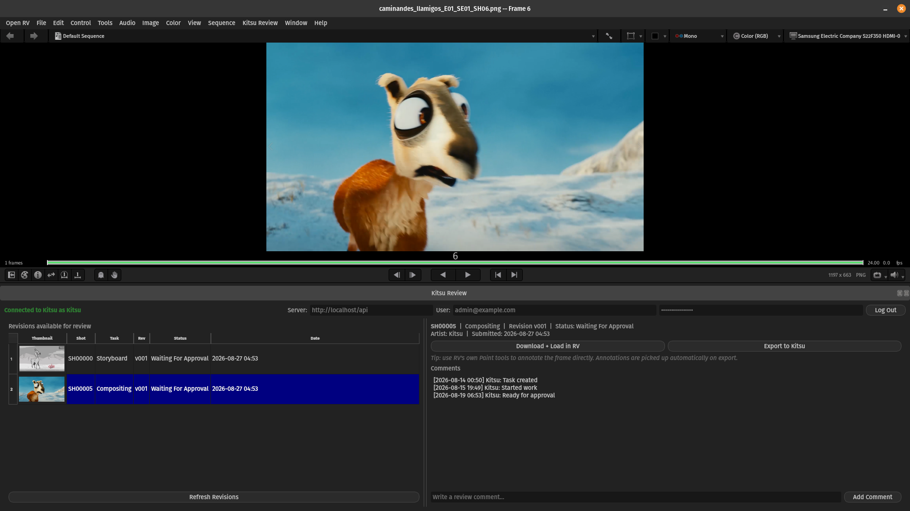

# OpenRV Kitsu integration



This OpenRV package integrates [CGWire's Kitsu](https://www.cg-wire.com/) in your workspace.

Features:

- Kitsu login
- Load WFA shots
- Read / send comments
- Pen annotations

Limitations:

- Doesn't handle shape annotations

## Installation

1. Download the latest package from the Github repository: [Releases](https://github.com/cgwire/openrv/releases)
2. Install the package in `OpenRV > Preferences > Packages > Add Packages`

## Development

1. Package the plugin for OpenRV:

```bash
zip -r kitsu.rvpkg ./src/PACKAGE ./src/kitsu.py
```

2. Install the package in `OpenRV > Preferences > Packages > Add Packages` or use the OpenRV CLI:

```sh
$OPENRV_PATH/_build/stage/app/bin/rvpkg -uninstall $HOME/.rv/Packages/kitsu-1.0.rvpkg -force
$OPENRV_PATH/_build/stage/app/bin/rvpkg -remove $HOME/.rv/Packages/kitsu-1.0.rvpkg -force
$OPENRV_PATH/_build/stage/app/bin/rvpkg -add $HOME/.rv/Packages PACKAGE_PATH/kitsu-1.0.rvpkg 
$OPENRV_PATH/_build/stage/app/bin/rvpkg -install $HOME/.rv/Packages/kitsu-1.0.rvpkg
```

## Contributing

## TODO

- handle shape annotations
- handle eraser